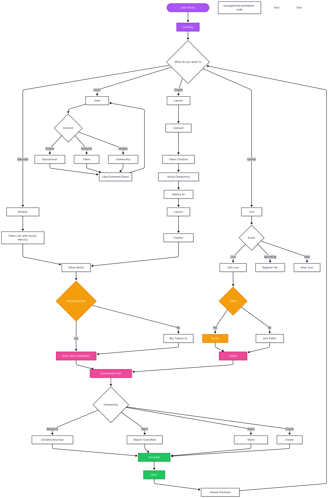

# MakeMeFamous

> **Where crypto gets social.** Join the community. Hold the token. Unlock the experience.

## What We've Built

The first social-native crypto platform where communities form around tokens, not just invest in them. Amazing social infrastructure that transforms how crypto communities connect and collaborate.

**Token creation meets social infrastructure** - because launching a token should create a community, not just a contract.

🔷 **Built on Polygon** - Fast, cheap transactions for seamless social experiences and token launches.

### Revolutionary Features

**🏠 Auto-Entry Social Clubs**
- **Token-gated chats** with automatic wallet-based access
- **Tiered communities**: Whale Chat, Diamond Hands, General Holders
- **Live membership updates** - buy in, join instantly; sell out, auto-removed
- **Exclusive experiences** unlock based on your holdings

**🕵️ Community Due Diligence** 
- **Collaborative research** with upvoting and verification
- **Scam detection** with humor: "This dev believes in trust falls"
- **Community warnings** that actually save people money
- **Reputation scoring** based on accurate predictions

**🎭 Creator Reputation System**
- **Cross-project accountability** - reputation follows you everywhere
- **Star ratings** that unlock platform privileges  
- **Community verification** of creator claims
- **Track record transparency** for all launches

**🎪 Live Social Experiences**
- **Community events** with live commentary and interaction
- **Creator AMAs** in token-gated spaces
- **Community challenges** and prediction markets
- **Real-time reactions** on price movements and announcements

**📚 User-Generated Alpha Hub**
- **Community-created guides**: "How to spot a rug pull"
- **Analysis and research** shared and verified by holders
- **Meme contests** and creative competitions
- **Creator spotlight** featuring top contributors

**📱 Social-Native Interface**
- **Live activity feed** showing real-time community updates
- **Interactive token cards** with reactions and social proof
- **Real-time chat integration** across all token communities
- **Mobile-first design** built for the TikTok generation

### Tech Stack

- **Next.js 15**: App Router with Turbopack for lightning-fast dev
- **TypeScript**: Type safety throughout
- **Tailwind CSS v4**: Custom design system with CSS variables
- **Framer Motion**: Smooth animations (ready to use)
- **Lucide React**: Beautiful icons
- **Class Variance Authority**: Type-safe component variants
- **Polygon Network**: Fast, low-cost blockchain for token creation and transactions
- **RainbowKit + Wagmi**: Web3 wallet connection and blockchain interaction

### Design Philosophy: Social Finance (SoFi)

**Community-First Economics**
- Holding tokens = joining exclusive social clubs
- Financial decisions become social experiences
- Community research replaces individual DYOR
- Reputation creates long-term incentive alignment

**Social Proof Over Marketing**
- Live community activity shows real engagement
- Peer verification beats paid promotions
- Creator accountability through cross-project reputation
- Authentic conversations in token-gated spaces

**Entertainment Meets Education**
- Learn through memes, guides, and community wisdom
- Scam detection with humor: "This dev believes in trust falls"
- Live events make investing social and fun
- Gamified due diligence through community challenges

**Inclusive but Exclusive**
- Anyone can join the conversation
- Token holders unlock the real experiences
- Tiered access based on commitment level
- Merit-based creator privileges


## 🌊 Development Roadmap

### **Wave 1: Foundation & Social UI ✅ COMPLETED**
*"Where crypto gets social"*

- ✅ Social-first platform design and branding
- ✅ Enhanced token cards with reactions and social metrics
- ✅ Three-panel layout (main content, social sidebar, activity feed)
- ✅ Token-gated chat UI components and tier system
- ✅ Live activity feed with real-time community updates
- ✅ Creator reputation system UI
- ✅ Responsive design system and component library

### **Wave 2: Core Social Infrastructure**
*"Connect wallets, join communities"*

- 🔗 **Wallet Integration**: RainbowKit connection with Polygon support
- 💬 **Real-Time Chat System**: Token-gated chat rooms with automatic entry/exit
- 👥 **Community Management**: Chat moderation, member roles, and permissions
- 🔄 **Live Membership Updates**: Real-time holder tracking and chat access
- 📊 **Basic Analytics**: Community activity, member growth, engagement metrics
- 🎭 **User Profiles**: Basic profile system with wallet-based identity

### **Wave 3: Token Creation & Launch System**
*"Build your community, launch your token"*

- 🚀 **Social Token Creator**: Community-driven token design and launch flow
- 🎪 **Launch Events System**: Live token reveals with community participation  
- 📈 **Smart Contract Deployer**: One-click token deployment on Polygon
- 🔒 **Liquidity Management**: Automatic liquidity locking and transparency
- 🎯 **Creator Dashboard**: Launch analytics, community management tools
- 🏆 **Achievement System**: Simple badges for creators and community members

### **Wave 4: Community Intelligence & Safety**
*"Collaborative research beats individual DYOR"*

- 🕵️ **Collaborative Due Diligence**: Community research tools and voting
- 🤖 **AI Scam Detection**: Smart contract analysis + community verification
- ⚡ **Real-Time Alerts**: Wallet movement tracking, suspicious activity warnings
- 📊 **Community Analytics**: Token holder analysis, whale watching, trend detection
- 🎯 **Reputation Engine**: Cross-project creator accountability system
- 🛡️ **Protection Tools**: Automated warnings, community reporting, safety scores

### **Wave 5: Advanced Social Experiences**
*"The future of social finance"*

- 🎤 **Live Audio Spaces**: Voice chat for token communities and events
- 📹 **Video Content Platform**: Short-form crypto content creation and sharing
- 🎮 **Gamified Experiences**: Prediction markets, community challenges, competitions
- 🏛️ **DAO Integration**: Token-weighted governance for platform decisions
- 💰 **Creator Economy**: Revenue sharing, sponsorships, premium subscriptions
- 🌐 **Cross-Chain Expansion**: Ethereum, Base, Arbitrum support

## 📊 Platform Flow Diagram




### Getting Started

**Development Server:**
```bash
npm run dev
```

Visit [http://localhost:3002](http://localhost:3002) to see the platform in action.

**Build for Production:**
```bash
npm run build
npm start
```


### Contributing

This is a solo project for now, but contributions welcome once we launch!

### License

MIT

---

**Remember**: **Community beats DYOR.** While you should always do your own research, our platform makes it collaborative. Learn from the community, but invest responsibly. Never invest more than you can afford to lose. Not financial advice.

---

**Built for the community, by the community.** 🚀

*Welcome to the social layer of DeFi.*
