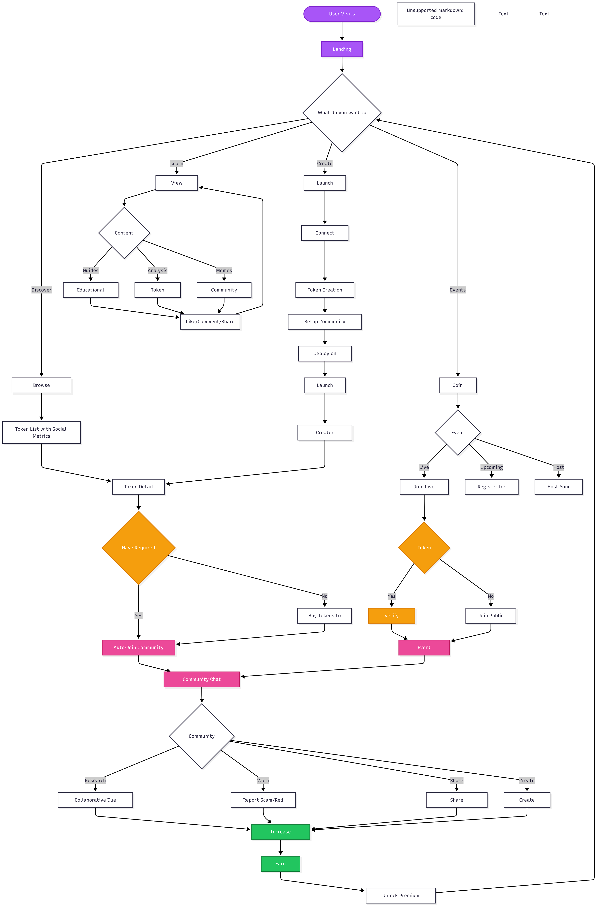

# MakeMeFamous

> **Where crypto gets social.** Create tokens, build communities, graduate to DEX.

The first social-native crypto platform where communities form around tokens, not just invest in them. Launching a token should create a community, not just a contract.

For waves progress check out:  [Roadmap](./docs/ROADMAP.md) | Development phases (Waves 1-10+)

## Built on Polygon

We chose **Polygon** as our foundation for the best user experience in social crypto:

| Feature | Benefit |
|---------|---------|
| **~$0.01 transactions** | Frequent social interactions without gas anxiety |
| **2-second blocks** | Real-time chat verification and instant trades |
| **7,000+ TPS** | Scale to millions of users and messages |
| **EVM compatible** | Leverage existing Ethereum tooling and standards |
| **QuickSwap integration** | Native DEX graduation with deep liquidity |

### Polygon Ecosystem Integration

- **Polygon PoS Chain** - Production-ready L2 with battle-tested security
- **QuickSwap V2** - Automatic DEX graduation for successful tokens
- **Polygon ID** (planned) - Zero-knowledge identity verification for creators
- **MATIC native** - All transactions and trading in MATIC

---

## Key Features

### Token Creation & Trading
- **One-Click Launch** - Create your social token for 0.01 MATIC
- **Bonding Curve** - Automated pricing where price rises with demand
- **MATIC Trading** - Enter MATIC amount, receive calculated tokens
- **Quick Buy Buttons** - 100, 500, 1000, 5000 MATIC instant options
- **Real-Time Prices** - Auto-refresh every 45 seconds with USD conversion

### DEX Graduation (pump.fun style)
- **Automatic Migration** - Tokens graduate to QuickSwap at 800k supply
- **Permanent Liquidity** - LP tokens burned, liquidity locked forever
- **Zero Graduation Fee** - 100% of accumulated MATIC goes to liquidity
- **Progress Tracking** - Visual progress bars for supply and liquidity goals

### Social Infrastructure
- **Token-Gated Chat** - Hold $10+ worth to access community chat rooms
- **Real-Time Messaging** - Socket.io powered with typing indicators
- **User Profiles** - Wallet-based identity with reputation scoring
- **Activity Feeds** - Live updates on trades, milestones, and events

### Creator Economy
- **1% Trading Fees** - Earn on every buy/sell of your token
- **Creator Dashboard** - Track volume, earnings, holders, and trades
- **Top Holders View** - See who's in your community
- **Revenue Analytics** - Historical performance and growth metrics

### Referral System (Periodically)
- **0.5% Forever** - Earn from referred users' trading fees permanently
- **Unique Links** - Auto-generated from wallet address
- **Leaderboards** - Compete for top referrer status at `/leaderboard`
- **Social Sharing** - One-click share to Twitter, Telegram

### Discovery & Engagement
- **Token Categories** - Creator, Artist, Gaming, Meme, Music, Infrastructure, AI
- **Advanced Search** - Filter by volume, holders, age, price
- **Watchlists** - Save tokens to personal list
- **Creator Follows** - See new tokens from followed creators
- **Price Alerts** - Notifications for specific price targets
- **Recommendations** - "Users who bought X also bought Y"

### Social Feed
- **Fame Feed** - Twitter-like social feed at `/fame` with Global/Following tabs
- **Posts** - Text, images (up to 4), token tags, link previews
- **Interactions** - Likes, comments, reposts with optimistic updates

### Platform Features
- **Leaderboard** - Rankings for tokens, creators, and referrers at `/leaderboard`
- **Notifications** - Toast alerts and notification bell for events
- **Dynamic OG Images** - Auto-generated social cards for sharing
- **Mobile Responsive** - Full functionality on all devices

---

## How It Works

```
┌─────────────────────────────────────────────────────────────┐
│  1. CREATE                                                   │
│     Launch token with name, symbol, image (0.01 MATIC)      │
├─────────────────────────────────────────────────────────────┤
│  2. TRADE                                                    │
│     Buy/sell on bonding curve (price rises with supply)     │
│     97% of MATIC accumulates as liquidity                   │
├─────────────────────────────────────────────────────────────┤
│  3. BUILD                                                    │
│     Token holders ($10+) get chat access                    │
│     Community forms around shared ownership                  │
├─────────────────────────────────────────────────────────────┤
│  4. GRADUATE                                                 │
│     At 800k tokens + 500 MATIC → migrate to QuickSwap       │
│     200k tokens minted for LP, paired with all MATIC        │
├─────────────────────────────────────────────────────────────┤
│  5. DEX TRADING                                              │
│     LP tokens burned = permanent liquidity                  │
│     Trade freely on QuickSwap with real market depth        │
└─────────────────────────────────────────────────────────────┘
```

---

## Token Economics

```
Total Supply: 1,000,000 tokens (hard cap)

Distribution:
├── 800,000 (80%) → Sold via bonding curve
│   └── Price increases as supply grows
│   └── MATIC accumulates for graduation
│
└── 200,000 (20%) → QuickSwap LP at graduation
    └── Minted only when criteria met
    └── Paired with accumulated MATIC
    └── LP tokens burned (permanent lock)

Fee Structure (per trade):
├── 1%  → Token Creator (your earnings)
├── 2%  → Platform Treasury
└── 97% → Liquidity Pool (future DEX liquidity)

Graduation Criteria:
├── 800,000 tokens sold (80% supply)
└── 500 MATIC minimum accumulated
```

---

## Tech Stack

| Layer | Technology | Purpose |
|-------|------------|---------|
| **Frontend** | Next.js 15, TypeScript, Tailwind CSS | Fast, type-safe UI |
| **Web3** | RainbowKit, Wagmi v2, Viem | Wallet connection & blockchain interaction |
| **Blockchain** | Polygon, Solidity 0.8.20, Hardhat | Smart contracts & deployment |
| **Backend** | Socket.io, Supabase | Real-time chat & database |
| **DEX** | QuickSwap V2 | Graduation liquidity |

---

## Current Deployment

### Polygon Amoy Testnet
| Contract | Address |
|----------|---------|
| SocialTokenFactory (V2) | [`0x267430ec1a61C7Aa7e3B2EEE7d4142208D31c9B9`](https://amoy.polygonscan.com/address/0x267430ec1a61C7Aa7e3B2EEE7d4142208D31c9B9) |

### Polygon Mainnet
Not yet deployed - coming soon after testnet validation.

---

## Quick Start

```bash
# Install dependencies
npm install

# Run development server
npm run dev

# Build for production
npm run build && npm start
```

Visit [http://localhost:3000](http://localhost:3000)

---

## Documentation

| Document | Description |
|----------|-------------|
| [Roadmap](./docs/ROADMAP.md) | Development phases (Waves 1-10+) |
| [Architecture](./docs/ARCHITECTURE.md) | Technical specs, APIs, database schema |

---

## Platform Flow



---


## License

MIT

---

**Built for the community, by the community.**

*Not financial advice. Never invest more than you can afford to lose.*
